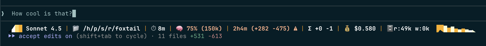
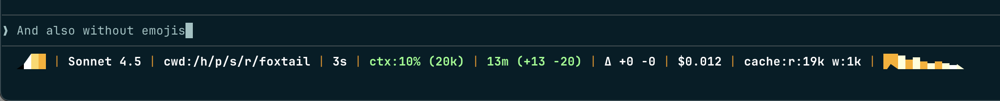

# foxtail

Claude Code statusline for Firefox developers. Shows model, cwd, time, context,
git status, session stats, cost, cache, etc.




## Usage

- Reads JSON on stdin and prints a status line.
- Flags:
  - `--print-config` print resolved config and a complete example
  - `--config <FILE>` use a specific config path
  - `--background {auto|light|dark}` set background mode (auto uses config, defaults to dark)
  - `--color {auto|always|never}` control ANSI color (respects `NO_COLOR`, `CLICOLOR`, `CLICOLOR_FORCE` when `auto`)
  - `--no-git` disable Git integration regardless of config

## Install

Install the binary:

```bash
cargo install foxtail
```

or using [cargo-binstall](https://github.com/cargo-bins/cargo-binstall):

```bash
cargo binstall foxtail
```

or from a local copy:

```bash
cargo install --path .
```

Add to `~/.claude/settings.json`:

```json
{
  "statusLine": {
    "type": "command",
    "command": "foxtail",
    "padding": 0
  }
}
```

`./install.sh` automates that if you have a local copy.

## Config

Create `~/.claude/statusline.toml`, `~/.mozbuild/foxtail.toml`, or
`~/.config/foxtail/config.toml`, and run `foxtail --print-config` to see how to
configure it.

## Development

Various scripts in this repo can help iterating on changes, don't reinvent the
wheel.

## License

Apache 2.0 or MIT

